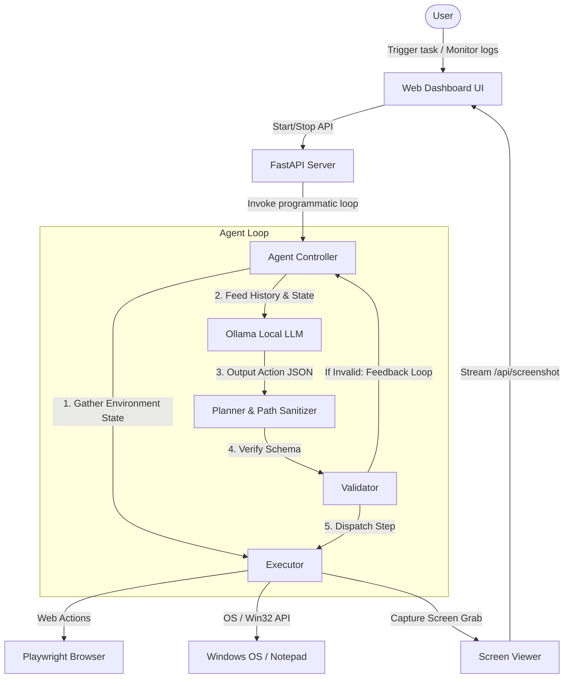

# Local AI Web & Desktop Automation Agent

A powerful, local-first AI agent that automates web browsers (via Playwright) and native Windows desktop applications (via custom win32/ctypes window handlers) through an interactive LLM orchestration loop. The agent features a premium web-based dashboard for real-time task triggers, log streaming, and screen mirroring.

---

## Key Features

* **Sleek Web Dashboard**: A glassmorphic, dark-themed control center featuring terminal log streaming (Server-Sent Events) and live screen updates.
* **Dual-Engine Automation**:
  * **Web Engine**: Utilizes Playwright to navigate, tag DOM elements with temporary IDs, click, type, and scrape interactive components.
  * **Desktop Engine**: Employs custom Windows API thread attachments to override focus restrictions and simulates Unicode typing and native key combinations. Includes direct Win32 message fallback (`WM_SETTEXT`) to write directly to background edit controls (e.g. Notepad).
* **Reliable File Explorer Tooling**: Programmatic `file_action` handler for directory listing, folder creation, file copying, moving, and deletion.
* **Auto-Sanitizing JSON & Self-Correction**: Custom regex path parsing to automatically correct single backslashes in Windows file paths, alongside a validator feedback loop that passes syntax warnings back to the LLM for auto-correction.

---

## System Architecture



---

## Setup & Installation

### 1. Prerequisites
* **Windows OS** (required for desktop/ctypes APIs)
* **Python 3.10+**
* **Ollama** installed and running on your local machine.

### 2. Download and Run Ollama Models
Ensure you have downloaded the default model (`qwen2.5:7b` is highly recommended, or `llama3`):
```bash
ollama pull qwen2.5:7b
```

### 3. Installation
Clone the repository and install dependencies:
```bash
# Navigate to the workspace directory
cd "D:\web automation"

# Install python dependencies
pip install -r requirements.txt

# Install Playwright browser engines
playwright install
```

---

## How to Run

1. Make sure **Ollama** is running locally in the background.
2. Launch the FastAPI dashboard server:
   ```bash
   python server.py
   ```
3. Open your browser and navigate to:
   **[http://localhost:8000](http://localhost:8000)**
4. Type your automation request in the sleek control card, select your active Ollama model, and click **Run Task**.

### Example Tasks to Try
* **Web Automation**: *"Open browser, go to wikipedia.org, search for 'Ollama' and click search."*
* **Desktop Automation**: *"Open notepad, type 'Sleek Dashboard Test' and save it to C:\Users\NARAEN\dashboard.txt"*
* **File Explorer Automation**: *"create directory C:\Users\NARAEN\agent_dir, write file C:\Users\NARAEN\agent_dir\test.txt with content 'Automation works!', copy that file to copy.txt, and delete the original."*

---

## Repository File Structure

* `server.py`: FastAPI server exposing running APIs, SSE step streams, and screenshot captures.
* `main.py`: Interactive programmatic agent runner and console execution engine.
* `planner.py`: Local LLM interface incorporating Windows path backslash sanitizers.
* `validator.py`: Action parameters schema validator.
* `executor.py`: Action dispatcher managing Playwright navigation, win32 keystrokes, and screenshot grabbing.
* `browser.py`: Playwright viewport tagging and DOM element wrapper.
* `utils.py`: Windows Win32 API helpers, Unicode simulated typers, and window focus overrides.
* `static/index.html`: Dashboard UI source file.
* `requirements.txt`: Python package dependency list.
